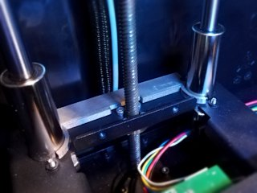
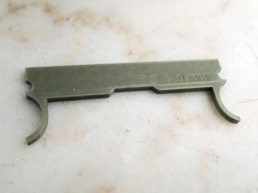

# Z-Axis shim spacer for 2016 FlashForge Creator Pro (for glass bed, customizable)
*3D printable customizable shim for using a glass bed in the FlashForge Creator Pro 2016 and similar (formerly thing:1886458)*

### License
[Creative Commons - Attribution - Share Alike](https://creativecommons.org/licenses/by-sa/4.0/)

### Attribution
This is a remix of “Z-Axis Shim in 3mm/4mm/5mm Versions for Flashforge Creator Pro Variant Models Glass Bed Powerspec Pro” by Atomist ([Thingiverse thing:557994](https://www.thingiverse.com/thing:557994)), and “Z-Axis Shim for Flashforge Creator Pro (for glass bed sold by flashforge-eu.com)” by ben8p ([Thingiverse thing:1475239](https://www.thingiverse.com/thing:1475239)).

### Gallery

[🔎](images/photo1.jpg) [🔎](images/photo2.jpg)

## Description and Instructions

If you want to install a glass bed or another print surface of considerable thickness on your printer, you need to adjust the height at which the Z endstop is triggered, because the extra thickness of the glass is added to the platform. If you don't do this, the platform will level too high and you are likely to run out of adjustment length of the levelling springs and be unable to level the plate, or even risk ramming the nozzle into the glass and breaking it.

The easiest way to do this, is to add a *shim* to the rear of the platform at the location of the Z endstop, to raise this part with roughly the same amount as the thickness of the extra plate. There are many shims available but I couldn't find any for the 2016 FlashForge Creator Pro, which seems to have screws in different places than other models, so here's a remix that fits. Ready-to-use models are available in thicknesses from 2 to 6 mm (0.08 to 0.24 inch).

For those who want to make a custom shim of any thickness between 1 and 10 mm, a customizable OpenSCAD model is provided. Open the `.scad` file in [OpenSCAD](https://www.openscad.org/) and **[use the OpenSCAD Customizer](https://www.dr-lex.be/3d-printing/customizer.html)** to create a model with your own desired specifications.

The shims are designed to slightly clamp themselves between the rods, but if you print them in PLA and often do prints with a hot enclosed chamber, they may lose their ‘springiness’ over time and become a little wiggly. This is not a problem and does not affect their function.

### Hints for Printing

Print at 0.1 mm layers if you want a reasonably accurate thickness, although this would only matter if you regularly swap between glass plates and things of other thicknesses and don't want to have to make large readjustments each time.

Use proper cooling and a sufficient number of top layers to avoid ‘pillowing.’

I don't recommend ABS for the shim because flat objects like these tend to curl up a bit when the ABS cools down after being printed. It is best for the shim to be perfectly flat. PETG is a good material but PLA will also do fine unless you're really going to be printing in a very hot enclosed chamber.

## Updates

### 2016/11/12
First publication on Thingiverse.

### 2017/05/01
Added 6 mm version

### 2017/07/30
Added an option to Customizer to reinforce the center of the part around the hole for the Z axis leadscrew. This allows to make thin shims that do not bend easily.

### 2021/06/15
Migrated to GitHub.

## TAGS
`2016`, `bed_leveling`, `customizable`, `customizer`, `FFCP`, `FFCPRo`, `Glass_bed`, `shim`, `spacer`, `Z-Axis`